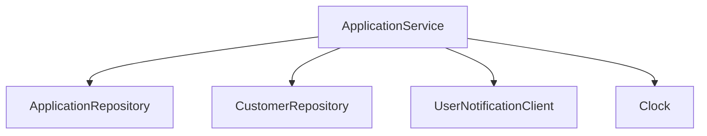

Hi. This is my repo for everything and nothing. It is used in [several blog posts](https://blog.f12.no) and for workshops.

# The Examples
This is a small collection of code I hope shows some good concepts. Please let me know what you think. 😄

This repo is updated continuously, so be sure to star and watch it for updates.

A few notes on things I am trying to show in this code. You can find links to the specific examples on each page (if there are any):
- [Test Driven Development](doc/tdd.md)
  - [Test Fakes](doc/fakes.md)
  - [Test Setup](doc/test-setup.md)
  - [Testing Through The Domain](doc/tttd.md)
- [System Design](doc/system-design.md)
  - [Manual Dependency Injection](doc/manual-dependency-injection.md)
  - [Sum types](doc/sum-types.md)

Reach out:
- [Discussions](https://github.com/anderssv/the-example/discussions)
- https://x.com/anderssv
- https://bsky.app/profile/anders.f12.no
- [anders@f12.no](mailto:anders@f12.no)

A lot of this content has come out of endless discussions with fellow developers.
But special thanks goes out to Asgaut Mjølne, Ola Hast, and Terje Heen for the regular discussions we have.

# The TDD Workshop

The contents in this repo is used as an example during my TDD workshop.

Duration: 4 hours

The TDD workshop covers an introduction to TDD, the techniques used to write tests,
and how to work with a simple architecture to achieve changeable systems and maintainable tests.

We will discuss along the way and will probably have to prioritise some things away. But we'll figure that out together.

**Part 1 - Introduction**: TDD, why it's useful, different test levels, test coverage, when it fits, and the difference between TDD and writing tests after the code is written. We also talk about the red-green-refactor cycle, arrange-assert-act, object mother with test data builders, and maintenance of tests and code.

**Exercise 1 - Bootup, test data and arrange-act-assert**

**Part 2 - Techniques**: Here we will talk about test levels, test doubles and separation of tests (fakes, mocks, and error situations), testing through the domain, abstract async, test utils, test validators, BDD and test DSL.

**Exercise 2 - Fakes, helpers, and DSLs**

**Part 3 - Testable and simple architecture**: We will talk about manual DI, queues in DB, SSE for listening to events, observability (logs, metrics, traces, opentelemetry, and agents), tricks (streaming, profiler, jcmd, heap and GC and local database).

**Exercise 3 - Manual DI, mocking and async testing**

**Conclusion**: Summary, questions and answers.

# Prepare

## Prerequisites
- Java 21 (managed via ASDF)
- Git

## Setup Instructions

### Build and terminal
1. Download this repository
   ```bash
   git clone https://github.com/anderssv/the-example.git
   cd the-example
   ```
2. Install ASDF following your platform's instructions from [asdf-vm.com](https://asdf-vm.com/guide/getting-started.html)
3. Install Java using ASDF:
   ```bash
   asdf plugin add java    # Only needed if you haven't installed the Java plugin before
   asdf install           # This will install Java 21 as specified in .tool-versions
   ```
4. Build the project:
   ```bash
   ./gradlew build
   ```
### Development environment

It works with most editors, but I recommend using IntelliJ IDEA.
Most stuff is good with default plugins, but I also recommend:
- [Mermaid](https://plugins.jetbrains.com/plugin/20146-mermaid) plugin
- [Markdown](https://plugins.jetbrains.com/plugin/7793-markdown) plugin
- [Supermaven](https://plugins.jetbrains.com/plugin/23893-supermaven) plugin
- [GitHub Copilot](https://plugins.jetbrains.com/plugin/17718-github-copilot) plugin


## Workshop System Context Diagram



The diagram above shows the main components of the system:
- **ApplicationService**: Core service managing application logic
- **Repositories**: Handle data persistence for Applications and Customers
- **UserNotificationClient**: Manages user notifications
- **Clock**: Provides time-related functionality
