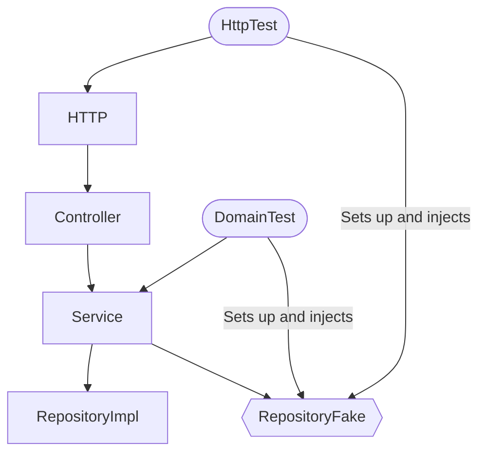

Part of [TDD](tdd.md)

---

> I am an independent consultant and would love to help your team get better at continuous delivery.
> Reach out
> at [anders.sveen@mikill.no](mailto:anders.sveen@mikill.no) or go
> to [https://www.mikill.no](https://www.mikill.no/contact.html) to contact, follow on social media or to see more of
> my work.

When you write tests, it is often important to isolate the tests.
This can be done in many ways,
but most of them are described in [this classic article by Martin Fowler (from 2006)
called Test Doubles](https://martinfowler.com/bliki/TestDouble.html).

> ✅ You can find a full test with fake example code
> in [ApplicationFakeTest.kt](../src/test/kotlin/application/ApplicationFakeTest.kt)

# Why fakes?

All types of test doubles have their uses, but I generally start with Fakes for everything, including the local
database.
They have very few downsides, and their speed (blazing fast) and maintainability makes them an excellent choice.
I find Fakes strike the best balance and are less vulnerable to unnecessary changes:

- They are instantly re-usable across tests as they mimic the integration/component they represent. ⚙️
- Changes in data structures are easier as there are fewer tests that set up things in different ways.
  Hundreds of compiler errors when a central class changes are no longer something that happens.
- Changes in behaviour fail fewer tests that should not be affected by the change.
- Twenty tests to fix because the data added in your real code doesn't match test setup any more? It's gone. 😎
- No temporary issues outside your control. Network, third party downtime, test envs that are slow. 💥
- Blazing Speed. It's all in memory baby. ♥️ 🔥
- No Flakiness. If Fakes are flaky, you have other issues to figure out. 😉

# Fakes are injected instead of the real implementations for testing

> Fake objects actually have working implementations, but usually take some shortcut which makes them not suitable for
> production - Martin Fowler

Because Fakes emulate the real system, they are an ideal drop in replacement when you are writing tests.
As the behaviour and state is encapsulated in the Fake,
you usually don't have to do a lot to set it up correctly and run tests against it.

The diagarm below shows how I use it regularly:



# I make fakes like...

It is quite simple really.
Almost anything can be faked with a
HashMap [[1](../src/test/kotlin/application/ApplicationRepositoryFake.kt)] [[2](../src/test/kotlin/notifications/UserNotificationClientFake.kt)].
Sometimes you need other solutions.
Below is a really simple example, but it turns out most fakes really are this
simple.

```kotlin
class CustomerRepositoryFake : CustomerRepository {
    private val db = mutableMapOf<String, Customer>()

    override fun addCustomer(customer: Customer) {
        db[customer.name] = customer
    }

    override fun getCustomer(name: String): Customer {
        return db[name]!!
    }
}
```

Unlike Mocks, you don't need a library.
Implement the interface you are faking, and put, update and fetch to/from the HashMap. 🚀

Sometimes the choice of "primary key" (the key in the hashmap) can be a bit awkward,
and implementing SQL like searches in a DbRepoFake can feel weird.
But it is all worth it.

# Verifying interactions and failures

When you write tests
and you use Fakes, you might find that you are missing the good old verifications of your beloved Mock framework.
And there are cases where you need those,
but the short answer is that you should verify system state as a _result_ of interactions.
Not the interactions themselves.

Let us say you are registering Applications,
and the registering process requires some updated info from an external system let's call it NationalCompanyRegistry.

You should:

- Add a specific company to the NationalCompanyRegistryFake.
- Verify that after system processing, the Application is registered with information _from_ the registry.

Something like this:

```kotlin
  @Test
fun testDataOrientedTest() {
    with(testContext) {
        val application = Application.valid()

        repositories.applicationRepo.addApplication(application)
        applicationService.approveApplication(application.id)

        assertThat(repositories.applicationRepo.getApplication(application.id).status).isEqualTo(ApplicationStatus.APPROVED)
    }
}
```

The trained eye might notice that there are certain improvements that can be made in the above test too.
Have a look at [Testing Through the Domain](tttd.md) for some more pointers.

If you really need to verify that the Fake received some information or was called, you can create custom methods
(only available in the Fake, not the interface) to verify those.
You can see an example of such a
method [here](https://github.com/anderssv/the-example/blob/main/src/test/kotlin/notifications/UserNotificationClientFake.kt#L26).

## Testing errors

Sometimes you will also need to test error situations.
I usually do this by creating a custom method and map in the Fake to register an error.

This way the test sets up the expectations, like ```nationalCompanyRegistryFake.failOnOrgNumber("...")```.

Some (very few times), I need to reliably test something like a 500-error code.
Then even I use mocks.
But I can honestly say that this has been max five times in the last 5 years.

# Isn't this a lot of work?

A little bit.
But it reduces the long time overhead and maintenance of tests and increases the speed you can run tests at right away.
Running stuff in memory is infinitely faster, even if the DB is on localhost.

If you do TDD, you only implement the features (in the fakes) as you need them.
It is perfectly fine to use IntelliJs "implement interface"
function that leaves (exception throwing) TODOs for every method.
Then you fix the ones needed to get your test passing.
Rinse and repeat.
😄

Once the method is implemented (with a HashMap), it is reusable across all your tests. 🏆

# What about the rest?

It all has to be tested. 😄 By using fakes, I find that I do:

- Dedicated repository tests to check input/output. Without Fakes.
- Dedicated incoming tests for checking OK+error cases in APIs and HTTP endpoints, etc. With fakes.
- Domain oriented tests. With fakes.

These aren't always exclusive.
I actually run most-edge tests with a "full system", except for Fakes on any external dependencies (including DB).
They run blazing fast.
😄

[Asgaut](https://asgaut.com/) that I have held talks with about this, insists on using faking the service layer under
HTTP, and it can be an option.
But I believe that you can avoid that if you are able to navigate around some common pitfalls in code.

The clue here is
to being able
to express and test all the unique combinations the system has to cater for in the domain-oriented tests with fakes,
and then have basic sanity checks for the "outer edges."

Also, see the [TDD](tdd.md) page for some relevant considerations and articles about what to test when.

# How do I get started?

Well, that's the really hard part.
If you're doing greenfield you should probably start as soon
as you have a Repository/Adapter/Client that uses some form of I/O.

If you are trying to do this in an existing code-base, I would probably try something like this:

1. Find a few parts of your code that make an important business decision. It can be things like price calculation,
   fraud detection or just a bit of advanced access control.
2. Then pick the one that has _the fewest_ repositories/adapters/clients involved.
3. Write a test that passes for the logic you want to test
4. Write a test for the part of the adapter that is exercised by this code
5. Create an interface for the adapter
6. Create a fake
7. Plug in the fake into the test instead of the real implementation. If you have mocking or some complex setup in the
   existing test I would probably duplicated it until it was working with the fake.
8. Clean up

And remember that many times important business decisions should be possible to test without any dependencies,
like pure functions.
When given input, then expect a certain result, without having to set up a lot of things.
But that won't get you started with Fakes will it?
😜

Or [get in touch with me](https://www.mikill.no/contact.html), and I will be happy to help you get started through some
workshops or coaching.

# Related reading

- [Martin Fowler: Test Doubles](https://martinfowler.com/bliki/TestDouble.html)
- [Test Doubles — Fakes, Mocks and Stubs](https://web.archive.org/web/20181227075532/https://blog.pragmatists.com/test-doubles-fakes-mocks-and-stubs-1a7491dfa3da#expand)
- [Test Doubles from the "Software Engineering at Google" book](https://abseil.io/resources/swe-book/html/ch13.html)
- [Mocks are bad... A quick summary](https://anderssv.medium.com/mocks-are-bad-a-quick-summary-7c70d9d3226c)
- [Prefer Fakes over Mocks](https://tyrrrz.me/blog/fakes-over-mocks)
