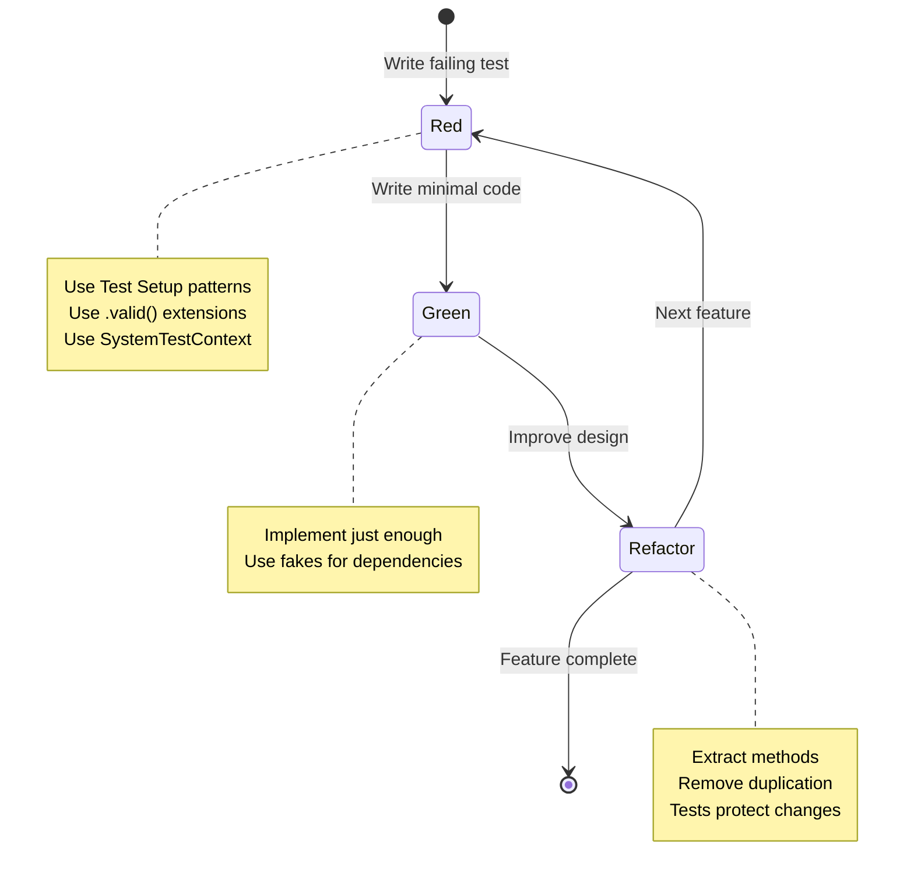
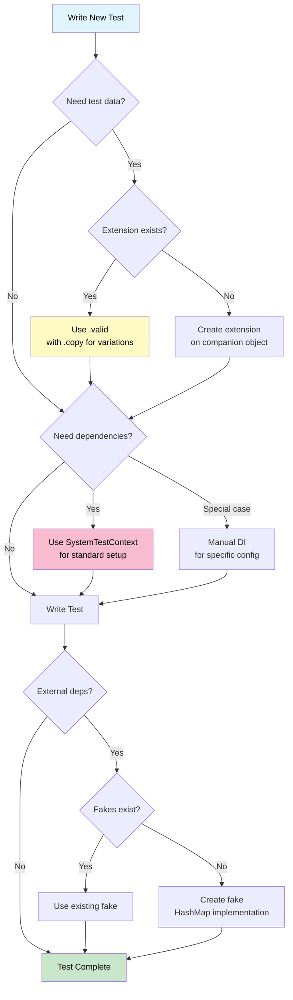
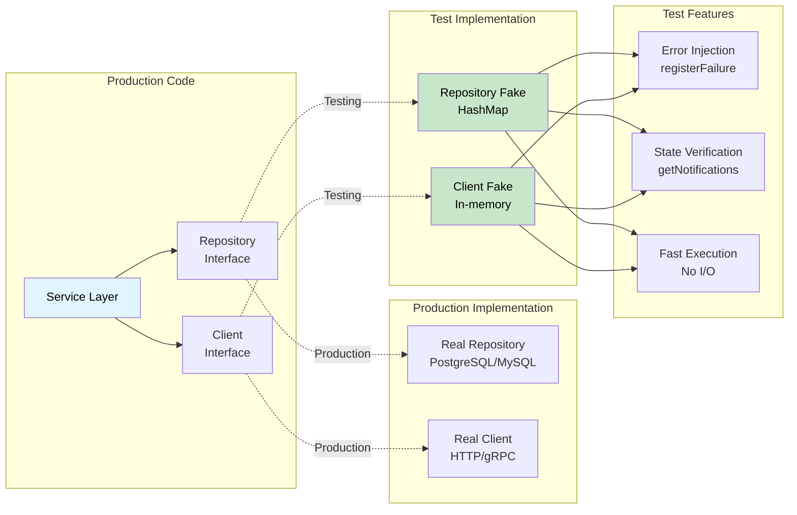
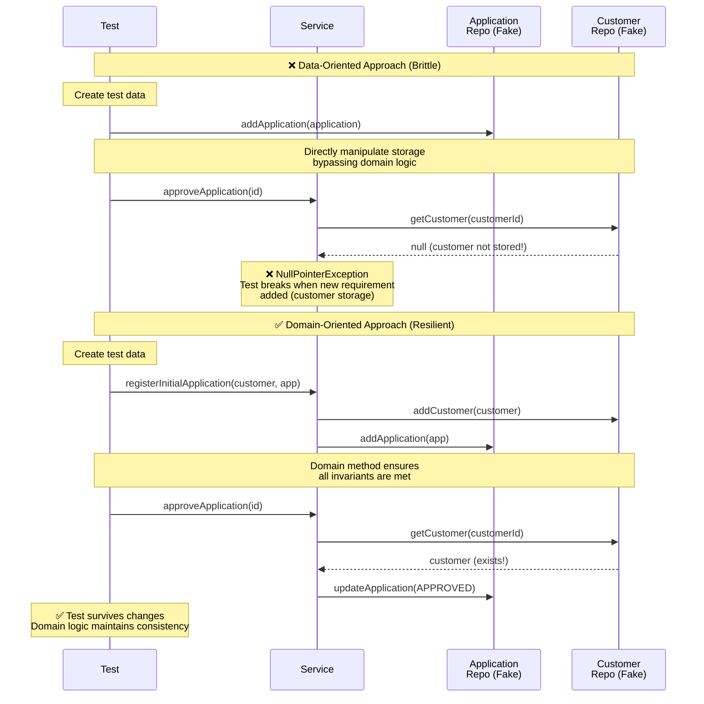
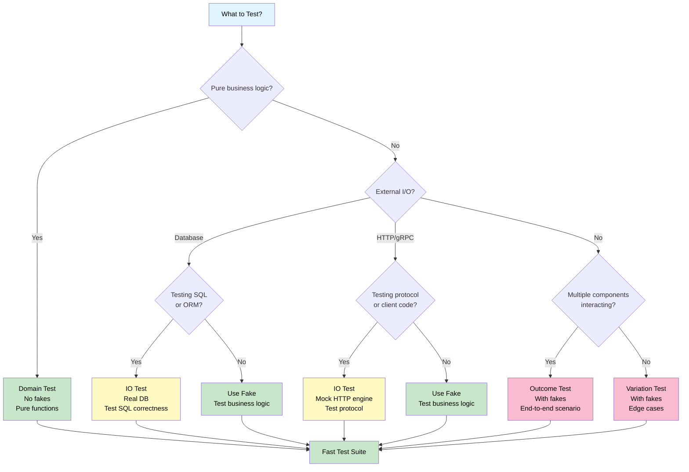
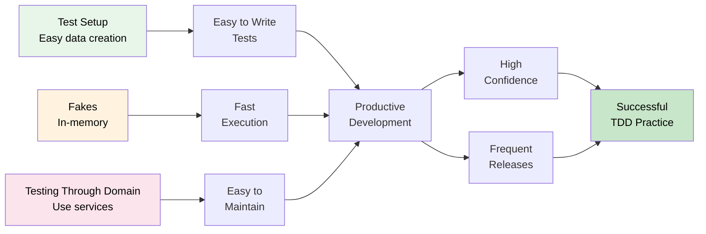
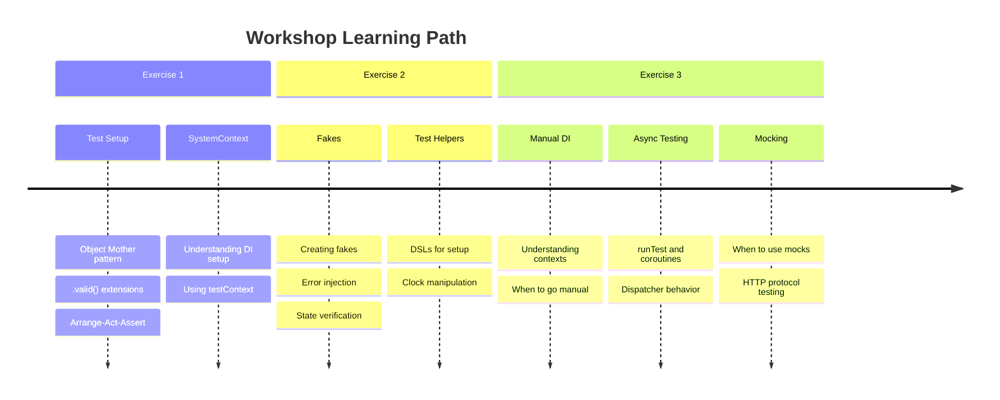
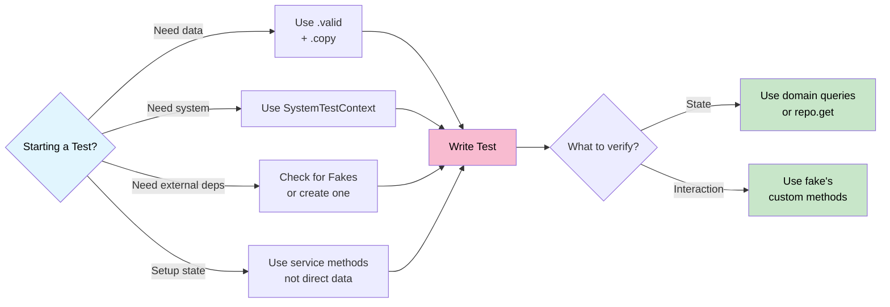

# TDD Concepts Overview

> [!NOTE]
> This is a completely AI generated file.
> But it did visualize some relationships in a good way, so I decided to keep it.
> Proceed with caution.
> :-)

This document provides a comprehensive visual overview of how all TDD concepts in this repository relate to each other and work together to create maintainable, fast, and reliable tests.

## Concept Relationships

### 1. Foundation: TDD Cycle

### 2. Test Setup Flow

### 3. Fake Usage Pattern

### 4. Testing Through the Domain

### 5. Test Type Decision Tree

## Key Takeaways

### The Three Pillars Work Together

1. **Test Setup** provides the foundation
   - Easy data creation with `.valid()` extensions
   - Consistent system setup with `SystemTestContext`
   - Reusable test helpers and DSLs

2. **Fakes** enable fast, reliable testing
   - In-memory implementations with HashMap
   - Configurable behavior for error scenarios
   - State inspection without mocking frameworks

3. **Testing Through the Domain** reduces brittleness
   - Use service methods to set up state
   - Verify outcomes, not implementation details
   - Tests survive refactoring

### Benefits Cascade

## Workshop Journey

The workshop exercises build on these concepts progressively:

## References

- [TDD Overview](tdd.md) - Philosophy and approach
- [Test Setup](test-setup.md) - Data and system setup patterns
- [Fakes](fakes.md) - Creating and using test fakes
- [Testing Through the Domain](tttd.md) - Domain-oriented testing
- [Manual Dependency Injection](manual-dependency-injection.md) - DI for tests
- [Workshop Exercises](workshop/README.md) - Hands-on practice
- [Exercise Answers](workshop/exercise-answers.md) - Detailed solutions

## Visual Cheat Sheet

### Quick Decision Guide

### Pattern Selection

| Scenario | Pattern | Example |
|----------|---------|---------|
| Need test data | Object Mother | `Application.valid()` |
| Complex variations | Helper parameters | `Application.valid(monthsOld=7)` |
| Simple variations | Copy method | `.copy(status=DENIED)` |
| Need system setup | Test Context | `SystemTestContext()` |
| Special DI config | Manual DI | Create services manually |
| External dependency | Fake | `ApplicationRepositoryFake()` |
| Test errors | Error injection | `fake.registerFailure(id)` |
| Verify interactions | Fake methods | `fake.getNotifications()` |
| Setup test state | Domain methods | `service.registerApplication()` |
| Verify outcomes | Domain queries | `service.isExpired(id)` |

---

**Remember**: These patterns work best when combined. Use test setup for easy data creation, fakes for fast execution, and domain-oriented testing for maintainability. Together, they make TDD predictable and easy.
