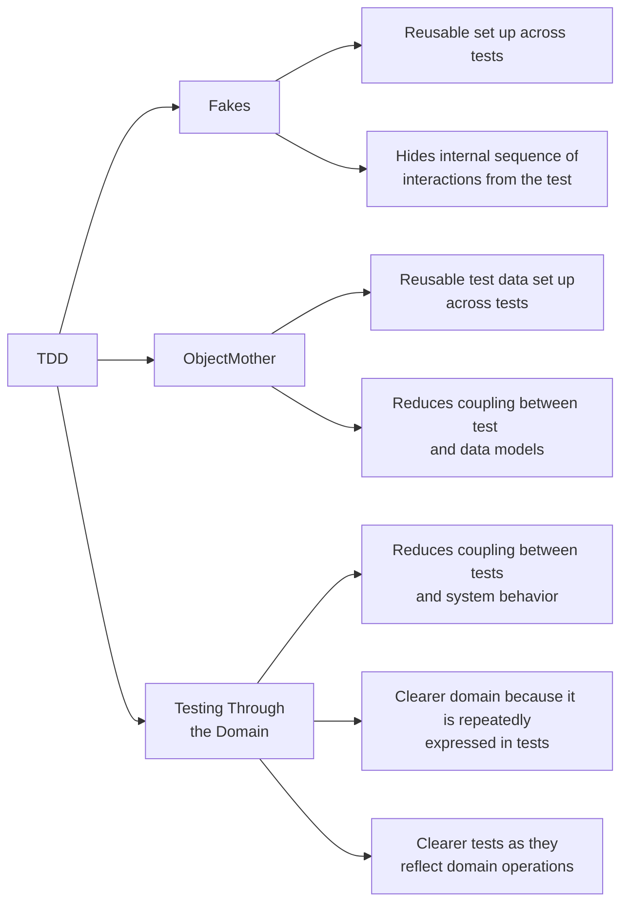
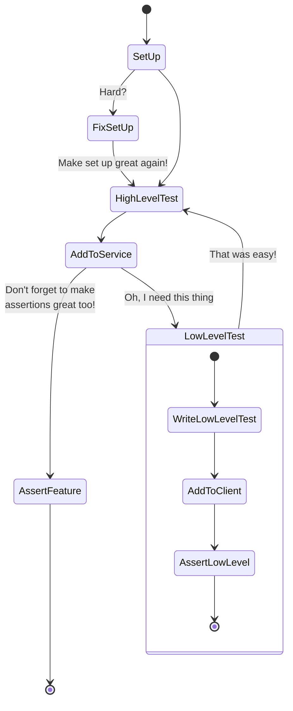
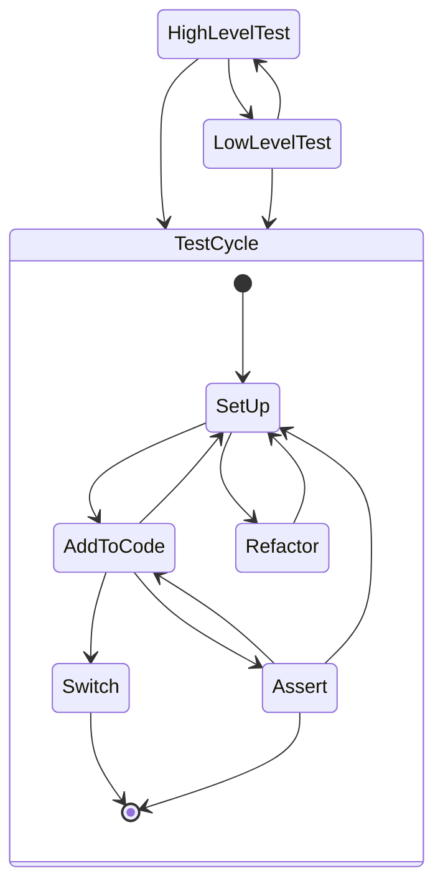

> This is the basis for some of the code examples in this repo. To jump straight into the test related example go to: [ApplicationFakeTest.kt](../src/test/kotlin/fakes/ApplicationFakeTest.kt)

Automated testing is always important to be able to go to production reliably. I find that I prefer to do TDD, and I think more people should too. But there seems to be some hurdles to get over for most people, and I think I know some decent ways to do just that. :)

Writing tests first has to be predictable and easy. I find that a certain combination of techniques gets me very close to that.

To write good tests they should be:
- Predictable (not flaky)
- Readable
- Easy to write
- Maintainable
  - Resistant to irrelevant changes in the domain
  - Resistant to irrelevant changes in the systems behaviour
- Fast

There are a bunch of other attributes as well, but these are the things I tend focus the most on. And these are the triangle of techniques that I use:

- [Object Mother or similar patterns](test-setup.md) to centralise and re-use test data set up. This makes it easier to find test data and write tests. It also reduces the exposure that each test has to the datastructures, and because of that it makes changes easier.
- [Fakes](fakes.md) as the main method for setting up test doubles. Fakes are more reusable than the alternatives, and gives a lower coupling to internal implementation details than for example mocks. Because of this they make it easier to write tests, and less exposed to irrelevant changes.
- [Testing Through the Domain](tttd.md), where you use the system actions to mutate state to the point in time you want to write assertions. This helps improve the domain code, forcing it to be clear at a high level readable steps, but also reduces the exposure tests have to changes in the logic of the system. A test that sets up assumed data is more exposed when the logic that produces those data changes.

# Test everything?

The good old days of measuring test coverage is over I hope, but I still measure it though. It is nice to see if it is trending upwards and downwards. And the tools that measure coverage can show _what_ is tested or not. That is important information in finding areas that *should* improve. :)

[How to decide on an architecture for automated tests](https://www.qwan.eu/2020/09/17/test-architecture.html) gives a really nice overview of different considerations. But I find I am less methodical when deciding and use a lot of intuition.

I usually start at (almost) "the top" of the feature I am trying to solve, and start typing. There are generally two things I look for then:
- Is it easy to write the test? Why not? Is it worth fixing now? Probably...
- When I make the first call to a service what underlying repos/adapters/clients do I need?

The last point often makes me switch to a different mode: Prepare the "bottom" for what I need to fix the entire feature. Then I might switch to dedicated tests for something like "find all expired applications in the database", before I return up top again. This cycle will be repeated multiple times while developing a feature.

# Related reading
- [How to decide on an architecture for automated tests](https://www.qwan.eu/2020/09/17/test-architecture.html)
- [Test scopes by Wisen Tanasa on Twitter](https://twitter.com/ceilfors/status/1687780512277069824)
