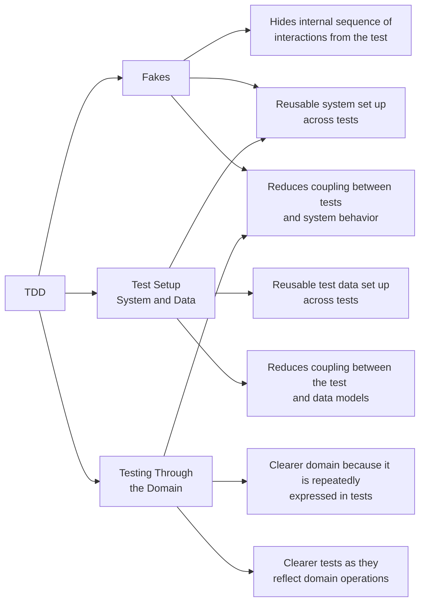

> I am an independent consultant and would love to help your team get better at continuous delivery.
> Reach out
> at [anders.sveen@mikill.no](mailto:anders.sveen@mikill.no) or go
> to [https://www.mikill.no](https://www.mikill.no/contact.html) to contact, follow on social media or to see more of
> my work.

Automated testing is always important to be able to go to production reliably.
I prefer to do TDD, and I think more people should too.
But there seems to be some hurdles to get over for most people, and I think the techniques I describe here can make it
easier.
😄

> ✅ This is the basis for some of the code examples in this repo.
> To jump straight into the related example,
> go to [ApplicationFakeTest.kt](../src/test/kotlin/application/ApplicationFakeTest.kt)

Writing tests first has to be **predictable and easy**.
These techniques get me very
close to that.

Good tests should be:

- Predictable (not flaky)
- Readable
- Easy to write
- Maintainable
    - Resistant to irrelevant changes in the domain
    - Resistant to irrelevant changes in the systems behavior
- Fast

There are a bunch of other attributes as well, but these are the things I tend to focus the most on.

And these are the main techniques that I use:

- [Test Setup](test-setup.md) to centralise and re-use test data and system set-up. This makes it easier to find test
  data and write tests. It also reduces the exposure that each test has to the datastructures. Because of that it makes
  changes easier.
- [Fakes](fakes.md) as the main method for setting up test doubles. Fakes are more reusable than the alternatives, and
  gives a lower coupling to internal implementation details than, for example, mocks. Because of this they make it
  easier to write tests, and less exposed to irrelevant changes.
- [Testing Through the Domain](tttd.md), where you use the system actions to mutate state to the point in time you want
  to write assertions. This helps improve the domain code, forcing it to be clear at a high level with readable steps.
  It also reduces the exposure tests have to changes in the logic of the system. A test that sets up assumed data is
  more exposed when the logic that produces those data changes.

It is not always easy to separate these levels, as they are kind of interconnected and feed into each other.

# What to test and how

The good old days of obsessing about test coverage are over, I hope. But I still measure it.
You do want to know if it is trending upwards or downwards.
And the tools that measure coverage can show _what_ is tested or not.
That is important information in finding areas that *should* improve.
😄

[How to decide on an architecture for automated tests](https://www.qwan.eu/2020/09/17/test-architecture.html) gives a
really nice overview of different considerations. But I find I am less methodical when deciding and use my intuition.

I write several types of tests:

- **Domain tests** - No Fakes - Ideally this is where you can write most of your tests. No fakes, no infrastructure, no
  nothing. Just pure business logic. But life happens, and you need the others too.
- **IO tests** — No Fakes — Like testing HTTP calls to a third party provider. Or testing the SQL in a DB Repo. This
  makes sure the Client/Repository class performs as expected.
- **Variation tests** — Fakes — Focus in on a part of the system. Test the available variations. Example: In generating
  mail content it should have this section included if the recipient has X attribute.
- **Outcome tests** — Fakes — This focuses on outcomes in interactions between components. Example: Was an email sent
  out with a rejected subject when the application was rejected?

Avoid verifying data in the database as much as possible,
test whether the email was sent through the `EmailClient` instead of checking if the `sent=true` in the database.
😄

The _combination_ of tests ensures we are safe to go to production.
There can always be blind spots, you have to consider whether those are worth covering.

## Switching between levels and test types

I usually start at (almost) "the top" of the feature I am trying to solve, and start typing. There are generally two
things I look for then:

- Is it easy to write the test? Why not? Is it worth fixing now? Probably...
- When I make the first call to a service, what underlying repos/adapters/clients do I need?

The last point often makes me switch to a different mode:
Prepare the "bottom" for what I need to fix the entire feature. Maybe write an IO test for a repo or an adapter.
Then I might switch to dedicated tests for something like "find all expired applications in the database,"
before I return up top again.
This cycle will be repeated multiple times while developing a feature.
I often switch to make sure I am not implementing features I _think_ I will need.

# Related reading

- [How to decide on an architecture for automated tests](https://www.qwan.eu/2020/09/17/test-architecture.html)
- [Test scopes by Wisen Tanasa on X](https://x.com/ceilfors/status/1687780512277069824)

Go [here to reach out for input or questions](../README.md). 😄
