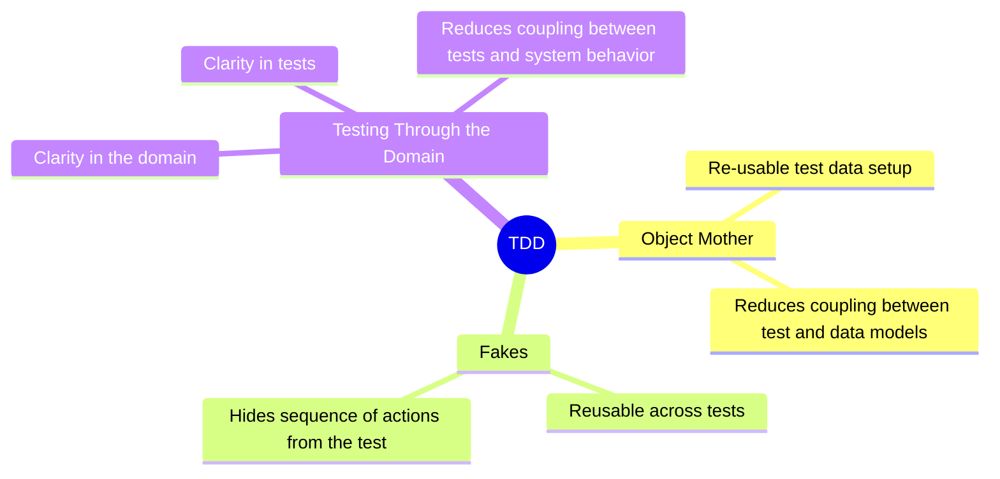

Autmated testing is always important to be able to go to production reliably. I find that I prefer to do TDD, and I think more should. But there seems to be some hurdles to get over for most people, and I think I know some decent ways to do just that.

Writing tests first has to be predictable and easy. And I find that a certain combination of techniques gets me close.

These are the main techniques that I use:

- Object Mother or similar patterns to centralise and re-use test data set up. This makes it easier to find test data and write tests. It also reduces the exposure that each test has to the datastructures, and because of that it makes changes easier.
- [Fakes](fakes.md) as the main method for setting up test doubles. Fakes are more reusable than the alternatives, and gives a lower coupling to internal implementation details than for example mocks. Because of this they make it easier to write tests, and less exposed to irrelevant changes.
- Testing Through the Domain, where I use the system actions to mutate state to the point in time I want to write assertions. This helps improve the domain code, forcing it to be clear at a high level readable steps, but also reduces the exposure tests have to changes in the logic of the system. A test that sets up assumed data is more exposed when the logic that produces those data changes.

