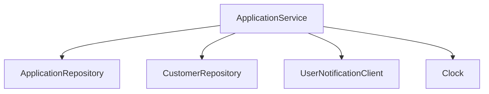
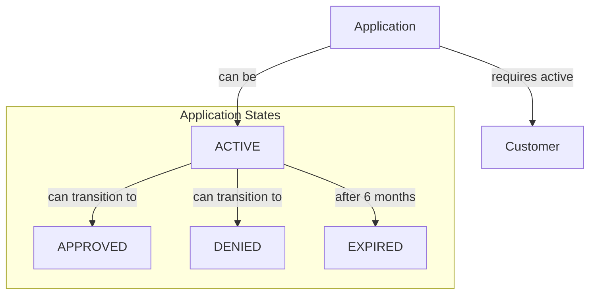

# The TDD Workshop

The contents in this repo is used as an example during my TDD workshop.

Duration: 4 hours

The TDD workshop covers an introduction to TDD, the techniques used to write tests,
and how to work with a simple architecture to achieve changeable systems and maintainable tests.

We will discuss along the way and will probably have to prioritise some things away. But we'll figure that out together.

**Part 1 - Introduction**: TDD, why it's useful, different test levels, test coverage, when it fits, and the difference between TDD and writing tests after the code is written. We also talk about the red-green-refactor cycle, arrange-assert-act, object mother with test data builders, and maintenance of tests and code.

**Exercise 1 - Bootup, test data and arrange-act-assert**

**Part 2 - Techniques**: Here we will talk about test levels, test doubles and separation of tests (fakes, mocks, and error situations), testing through the domain, abstract async, test utils, test validators, BDD and test DSL.

**Exercise 2 - Fakes, helpers, and DSLs**

**Part 3 - Testable and simple architecture**: We will talk about manual DI, queues in DB, SSE for listening to events, observability (logs, metrics, traces, opentelemetry, and agents), tricks (streaming, profiler, jcmd, heap and GC and local database).

**Exercise 3 - Manual DI, mocking and async testing**

**Conclusion**: Summary, questions and answers.

## Workshop System Context Diagram

The diagram above shows the main components of the system:
- **ApplicationService**: Core service managing application logic
- **Repositories**: Handle data persistence for Applications and Customers
- **UserNotificationClient**: Manages user notifications
- **Clock**: Provides time-related functionality

## Domain Model (Application's Perspective)

The domain diagram above shows:
- **Application**: Core domain entity with its possible states
- **Customer**: Required for application processing
- **State Transitions**: Shows how an application can move between different states
- **Rules**:
    - Applications require an active customer
    - Active applications can be approved or denied
    - Applications expire after 6 months
