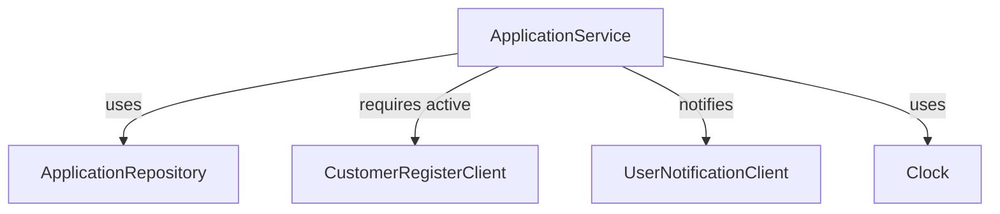
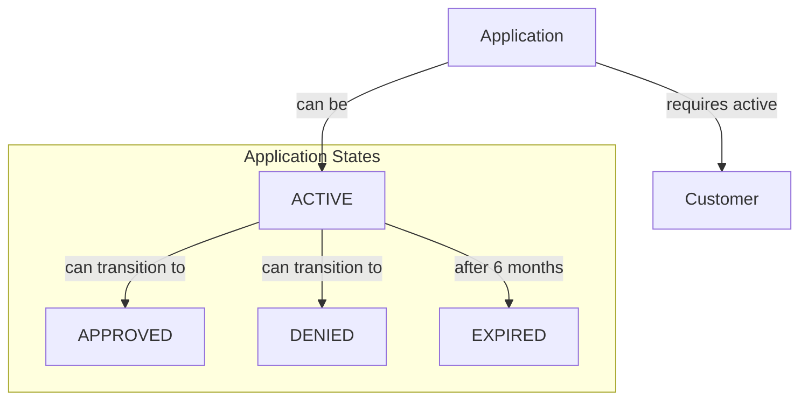

# Workshop System Context Diagram

The diagram above shows the main parts of the system:
- **ApplicationService**: Core service managing application logic
- **Repositories**: Handle data persistence for Applications and Customers
- **UserNotificationClient**: Manages user notifications
- **Clock**: Provides time-related functionality

# Domain Model (Application's Perspective)

The domain diagram above shows:
- **Application**: Core domain entity with its possible states
- **Customer**: Required for application processing
- **State Transitions**: Shows how an application can move between different states
- **Rules**:
    - Applications require an active customer
    - Active applications can be approved or denied
    - Applications expire after 6 months
